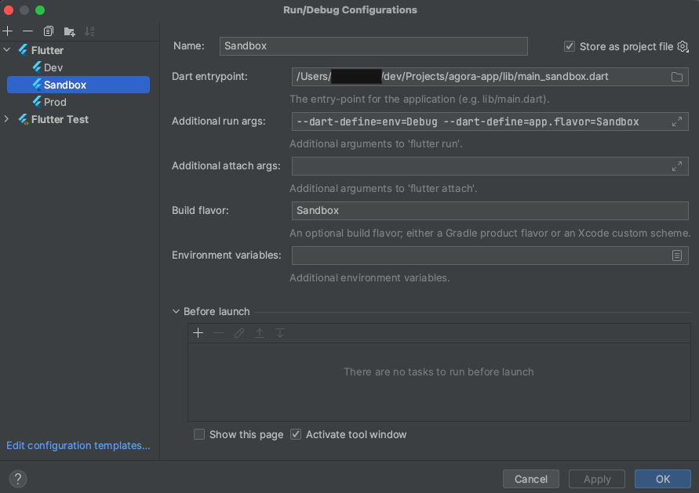
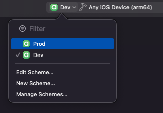

# Agora onboarding

## Content

1. [Setting project](#1-setting-project)
   * [Install flutter](#a-install-flutter)
   * [Update flutter](#b-update-flutter)
   * [Android module Gradle setup](#c-android-module-gradle-setup)
   * [Configure Dart style](#d-configure-dart-style)
   * [Add/Remove GitHooks (optional)](#e-addremove-githooks-optional)
2. [Compile project](#2-compile-project)
   * [Android](#a-android)
   * [iOS](#b-ios)
3. [Read other docs](#4-read-other-docs)


## 1. Setting project
### a. Install Flutter
- [Download and install Flutter](https://docs.flutter.dev/get-started/install)
- After installing Flutter, configure your flutter path in `Intellij IDEA` > `Settings`.


### b. Update Flutter
- ONLY use `stable channel`.
- [Update Flutter](https://docs.flutter.dev/release/upgrade)
- This will both update `flutter version` and `dart version`
- when dart version is changed pay attention to :
  - sdk version in `pubspec.yaml`
   ```
      environment:
      sdk: '>=3.0.5 <4.0.0'
    ```
- when flutter version is changed pay attention to :
  - flutter version in `agora/.github/workflows/mobile.yml`
  ```      
    - uses: subosito/flutter-action@v2
      with:
        flutter-version: "3.10.5"
        channel: 'stable'
        cache: true
  ```

### c. Android module Gradle setup
- Go to `agora/android/build.gradle` right click on it and click on `Link Gradle Project`.
- Open the `Gradle Tool Window` (if tab doesn't appear, click on `IntelliJ IDEA` > `View` > `Tool Windows` > `Gradle`), click on `+` and select the `android/` folder.
- Gradle sync the Android project and error disappear.

### d. Configure Dart style
- Open `IntelliJ IDEA` > `Preferences` > `Editor` > `Code Style` > `Dart`, Change Line Length to `120`
- `shift` + `option` + `Command` + `l` > `pop-up opened` > select `Optimize imports`

### e. Add/Remove GitHooks (optional)
This command will format code, launch test, etc. when you `git commit` and `git push`
```shell
  git config core.hooksPath .githooks/
```
```shell
  git config --unset core.hooksPath
```

## 2. Compile project

Current list of valid environments:
- Dev, to target a testing environment
- Prod, to target production environment
  Please make sure to use `Sandbox` environment for testings purposes.

### a. Android

#### i. Using Android Studio
Make sure to change the target environment before attempting to compile project with Android Studio:




- Configure `--dart-define=app.flavor=XX` and `Build flavor : XX` => XX must be identical.
- `--dart-define=app.flavor=XX` is used in `flavor_helper.dart` file.

The app's icon and status bar should change color depending on built environment:
- Orange for Sandbox
- Green for Dev
- Blue for Prod

#### ii. Using command line scripts

Use either:
- `agora/generateSandboxApk.sh` to have a build that targets Sandbox environment
- `agora/generateDevApk.sh` to have a build that targets Dev environment
- `agora/generateReleaseBundle.sh` to have a build that targets Prod environment

### b. iOS

Launch a command line script first to choose the target environment (an error will appear but no worries...)
- `agora/generateSandboxIpa.sh`, to have a build that targets Sandbox environment
- `agora/generateDevIpa.sh`, to have a build that targets Dev environment
- `agora/generateReleaseIpa.sh`, to have a build that targets Prod environment
- On `Xcode`, choose the scheme (middle top of the screen) that matches chosen target


- Now you can build and launch iOS app in `Xcode`

## 4. Read other docs
- `agora/docs/2_git.md`
- `agora/docs/3_coding_convention.md`
- `agora/docs/4_hive.md`
- `agora/docs/5_generate_app_logo.md`
