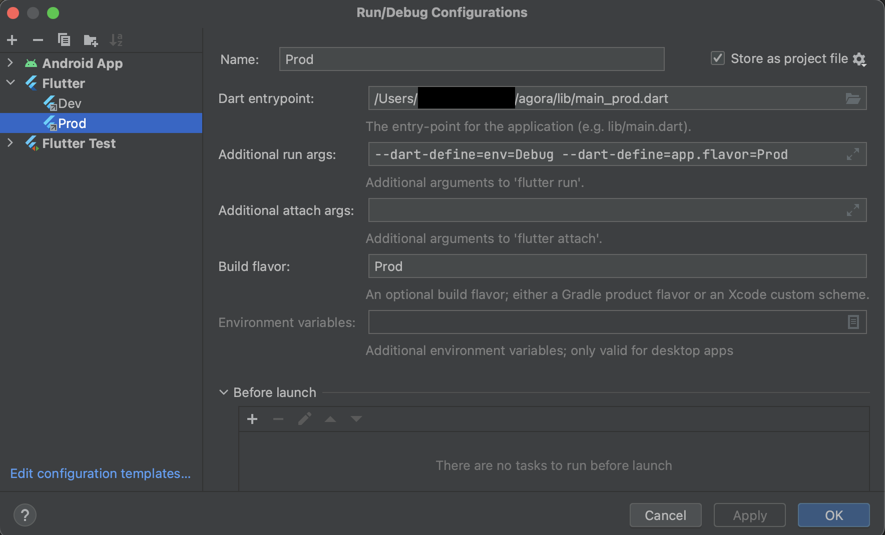

# Agora onboarding

## Content

1. [Setting project](#1-setting-project)
   * [Install flutter](#a-install-flutter)
   * [Update flutter](#b-update-flutter)
   * [Android module Gradle setup](#c-android-module-gradle-setup)
   * [Configure Dart style](#d-configure-dart-style)
   * [Add githooks / Remove githooks (optional)](#e-add-githooks--remove-githooks-optional)
2. [Firebase](#2-firebase)
3. [Compile the project](#3-compile-the-project)
   * [Android](#a-android)
   * [iOS](#b-ios)
4. [Read other docs](#4-read-other-docs)


## 1. Setting project
### a. Install Flutter
- [Download and install Flutter](https://docs.flutter.dev/get-started/install)
- After installing Flutter, configure your flutter path in `Intellij IDEA` > `Settings`.


### b. Update Flutter
- ONLY use `stable channel`.
- [Update Flutter](https://docs.flutter.dev/release/upgrade)
- This will both update `flutter version` and `dart version`
- when dart version is changed pay attention to :
  - sdk version in `pubspec.yaml`
   ```
      environment:
      sdk: '>=3.0.5 <4.0.0'
    ```
- when flutter version is changed pay attention to :
  - flutter version in `agora/.github/workflows/mobile.yml`
  ```      
    - uses: subosito/flutter-action@v2
      with:
        flutter-version: "3.10.5"
        channel: 'stable'
        cache: true
  ```


### c. Android module Gradle setup
- Go to `agora/android/build.gradle` right click on it and click on `Link Gradle Project`.
- Open the `Gradle Tool Window` (if tab doesn't appear, click on `IntelliJ IDEA` > `View` > `Tool Windows` > `Gradle`), click on `+` and select the `android/` folder.
- Gradle sync the Android project and error disappear.

### d. Configure Dart style
- Open `IntelliJ IDEA` > `Preferences` > `Editor` > `Code Style` > `Dart`, Change Line Length to `120`
- `shift` + `option` + `Command` + `l` > `pop-up opened` > select `Optimize imports`

### e. Add githooks / Remove githooks (optional)
This command will format code, launch test, etc. when you `git commit` and `git push`
```shell
  git config core.hooksPath .githooks/
```
```shell
  git config --unset core.hooksPath
```

## 2. Firebase

- Download and install [Firebase CLI](https://firebase.google.com/docs/cli)
- run `firebase login`
- run `dart pub global activate flutterfire_cli`
- add `flutterfire` to your path running `export PATH="$PATH":"$HOME/.pub-cache/bin"` (you can also put it on your default in your .zshrc)
- run `flutterfire configure --project=agora-dev-6c6bd`

This should generate the following files:
- /ios/firebase_app_id_file.json
- /ios/Runner/GoogleService-Info.plist
- /lib/firebase_options.dart
- /android/app/google-services.json


## 3. Compile the project

### a. Android




- Configure `--dart-define=app.flavor=XX` and `Build flavor : XX` => XX must be identical.
- `--dart-define=app.flavor=XX` is used in `FlavorHelper`.

### b. iOS
- Launch command line in `agora/generateReleaseIpa.sh` first (maybe error appeared or not...)
- Now you can build and launch iOS app in `Xcode`

## 4. Read other docs
- `agora/docs/2_git.md`
- `agora/docs/3_coding_convention.md`
- `agora/docs/4_hive.md`
