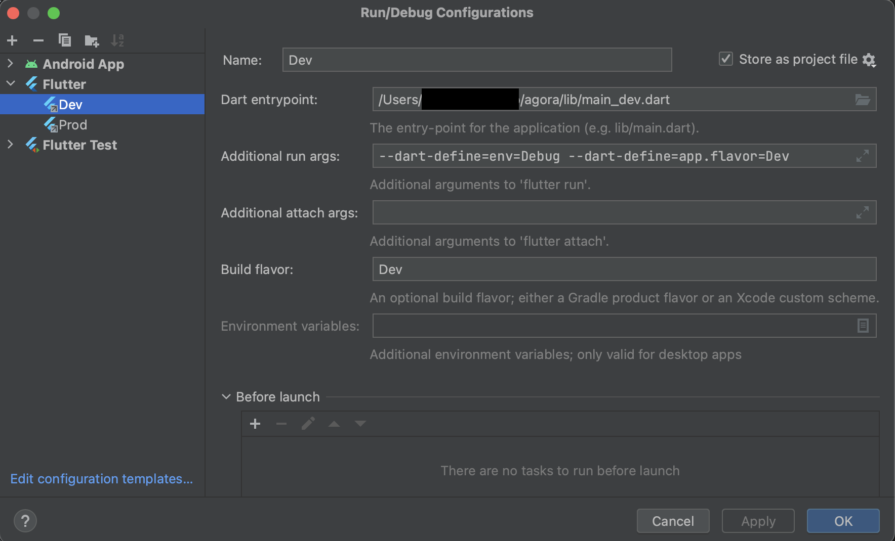
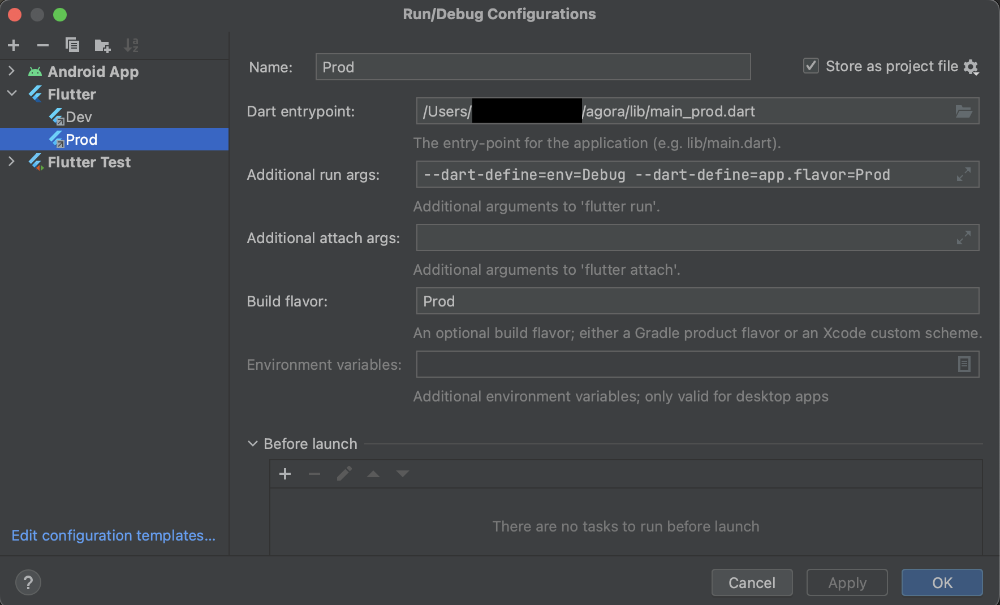

# Agora onboarding

## Content

1. [Setting project](#setting-project)
2. [Firebase](#firebase)
3. [Compile the project](#compile-the-project)


## Setting project

### 1. Android module Gradle setup
- Go to `agora/android/build.gradle` right click on it and click on `Link Gradle Project`.
- Open the `Gradle Tool Window` (if tab doesn't appear, click on `IntelliJ IDEA` > `View` > `Tool Windows` > `Gradle`), click on `+` and select the `android/` folder.
- Gradle sync the Android project and error disappear.

### 2. Configure Dart style
- Open `IntelliJ IDEA` > `Preferences` > `Editor` > `Code Style` > `Dart`, Change Line Length to `120`
- `shift` + `option` + `Command` + `l` > `pop-up opened` > select `Optimize imports`

### 3. Add githooks / Remove githooks
```shell
  git config core.hooksPath .githooks/
```
```shell
  git config --unset core.hooksPath
```

## Firebase

- Download and install [Firebase CLI](https://firebase.google.com/docs/cli)
- run `firebase login`
- run `dart pub global activate flutterfire_cli`
- add `flutterfire` to your path running `export PATH="$PATH":"$HOME/.pub-cache/bin"` (you can also put it on your default in your .zshrc)
- run `flutterfire configure --project=agora-dev-6c6bd`

This should generate the following files:
- /ios/firebase_app_id_file.json
- /ios/Runner/GoogleService-Info.plist
- /lib/firebase_options.dart
- /android/app/google-services.json


## Compile the project




- Configure `--dart-define=app.flavor=XX` and `Build flavor : XX` => XX must be identical.
- `--dart-define=app.flavor=XX` is used in `FlavorHelper`.