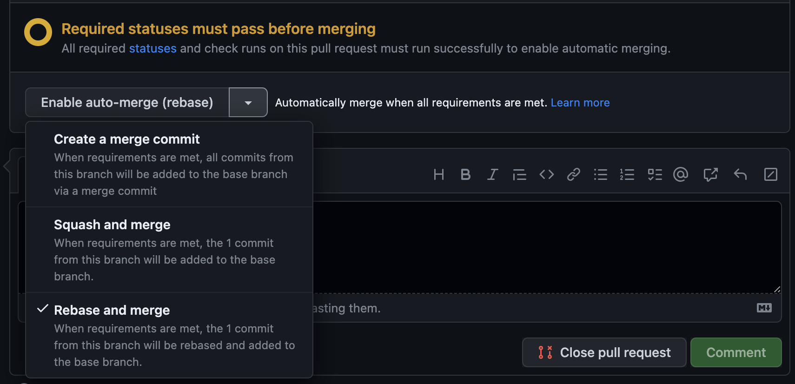

# Git utils

## Content

1. [Commit naming](#1-commit-naming)
2. [Branch naming](#2-branch-naming)
3. [Branch merging](#3-branch-merging)
4. [Pull requests](#4-pull-requests)


## 1. Commit naming

We use this convention:

```text
<type>-<ticket-number>: <name of commit>
```

Examples :

```text
feat-1: add files
refactor: fix somethings
```

## 2. Branch naming
`<type>`/`<ticket-number>`-`<name-of-branch>`.

`<type>` could be :
  - feat
  - refactor
  - tech
  - feedback
  - fix

Example: *feat/1-details*

## 3. Branch merging

```shell
## Ensure your develop branch is up-to-date
git checkout develop
git pull --rebase

## Go to your current branch and rebase it onto develop
git checkout feat/1-details
git rebase develop
git push --force-with-lease #never use git push -f
```

## 4. Pull requests

- Create new branch from `develop` and push it to GitHub (see [3. Branch merging](#3-branch-merging)).
- Create pull requests in GitHub
- Merge with `Rebase and merge option`

